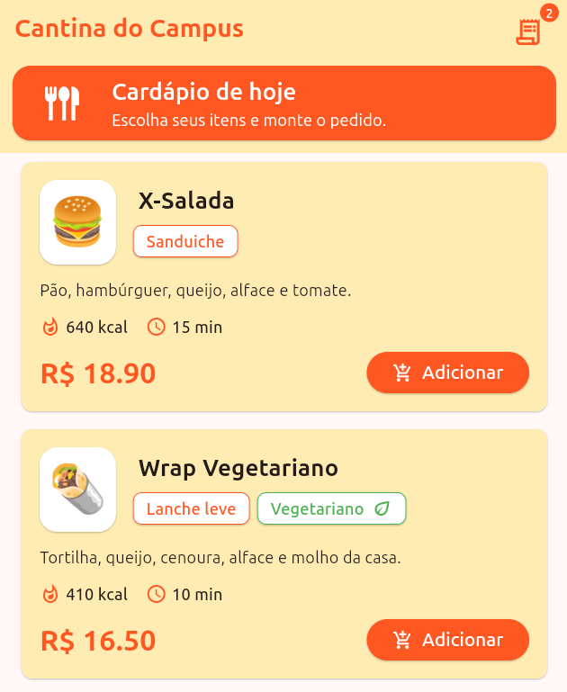
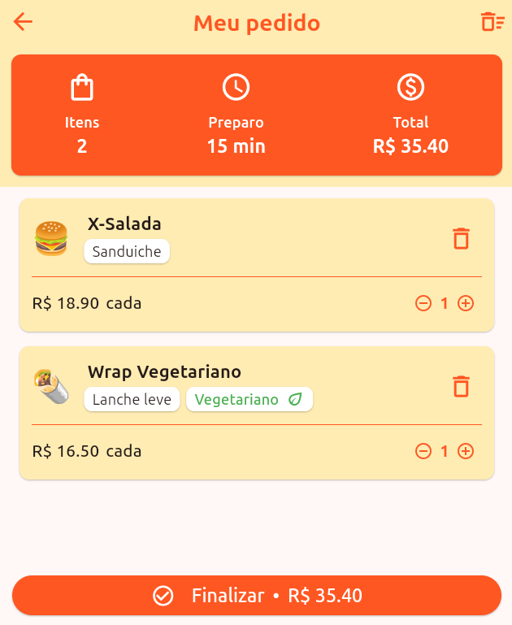
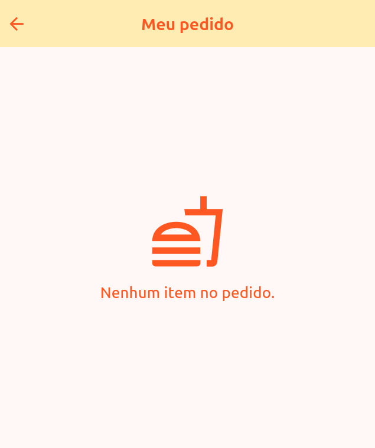

# Atividade prática de Flutter + MobX 

* **Aluna:** Izadora Bernardi
* **Instituto:** IF Goiano - Campus Rio Verde
* **Disciplina:** Desenvolvimento de Aplicações Híbridas 
---

## Exercício 01 - Cantina do Campus

Dependências: `mobx`, `flutter_mobx`, `mobx_codegen`, `build_runner`, `get_it`

### Página de Cardápio (menu)

 
Cada opção do cardápio possui as informações de `nome`, `descrição`, `categoria`, se é `vegetariano`, `preço` unitário, quantidade de `calorias`, `tempo` de preparo e `preço` unitário.

0 usuário pode navegar pelas opções e adicioná-las ao pedido usando o botão **Adicionar**. Para visualizar o pedido, basta clicar no ícone do canto superior direito.

### Página de Meu Pedido (order)

    
    

No topo da tela, há uma visualização indicando o `total de itens`, `tempo máximo` de preparo e o `preço total` que deve ser pago pelo pedido.

Nessa página, o usuário pode adicionar ou remover pedidos um a um utilizando os ícones de **(+)** e **(-)**, respectivamente; remover todos um itens de um certo tipo pelo ícone de **lixeira**; e até mesmo remover o pedido completo pelo ícone no canto superior direito.

O usuário pode finalizar o pedido clicando no botão de **Finalizar** e o programa vai abrir uma caixa de diálogo com o resumo do pedido. Ao clicar em **OK**, o pedido resetado.